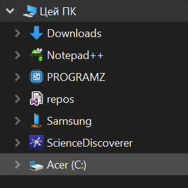

# Firefox
My take on modifying user interfaces of some of my most used software.

Firefox changes:

* Force minimal tab width to be the same as for the pinned tabs
* Remove 'close tab' button from tabs (I guess they can be displayed when number of tabs are small, but I didn't bother)
* Swap tab favicon margin for Title's padding to ensure uniform shape
* Remove right spacer
* Remove 'all opened tabs' list button
* Invert bookmark and tab favicon (as it was not visible on dark background; this way its possible to change it for custom favicon too)
* Use [Tab Counter Plus](https://addons.mozilla.org/en-US/firefox/addon/tab-counter-plus/) instead of right spacer and set up code to hide it when tabs do not overflow.

I also fixed issues with titlebar min/max/close buttons when using non-standard Windows Theme.

Tutorials:
* [How to enable and set up userChrome.css](https://www.reddit.com/r/firefox/wiki/userchrome/)
* [Setting up browser toolbox to live-test your changes](https://firefox-source-docs.mozilla.org/devtools-user/browser_toolbox/index.html)

Tip: You can find userChrome.css in `Stylesheet Editor` tab and edit it there for testing, or edit live browser elements directly, inline.

# Windows
`ULTIMATE_W10_FIX.REG` - extensive registry tweaks that makes Windows/Explorer UI much more intuitive and usable. Mostly removes useless context menu items and replaces them with the useful ones. But also does many other important tweaks. You can see all list in source code, in the comments.

`ULTIMATE_W10_UNFIX.REG` - reverses changes done by the previous script.

`MY_PC_CUST_SCIENCEDISCOVERER_ADD.REG` - Adds your custom folder to `This PC`, so that you can disable `Quick Access` entirely and use neat custom shell folders in your navigation pane like this:

To add more folders, just change it name (`@="ScienceDiscoverer"`), icon (`DefaultIcon` key), target folder (`"TargetFolderPath"="C:\\ScienceDiscoverer"`) and generate new GUID, then replace all GUIDs with it. Done.

`MY_PC_CUST_SCIENCEDISCOVERER_DEL.REG` - removes the custom folder
